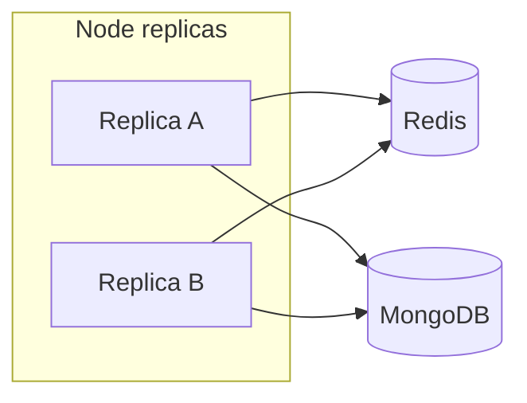

# Shared room store (Tier C) — design outline

**Status:** Not implemented. Required before horizontal scale beyond sticky sessions + Redis adapter.

## Problem

Party games (Taboo, CAH, Hangman, Typing Race) keep authoritative room state in process memory. The Redis Socket.IO adapter ([`backend/src/realtime/socketServer.js`](../backend/src/realtime/socketServer.js)) synchronizes **broadcasts** only — join/create on replica B still fails if the room was created on replica A.

NPAT already persists engine snapshots to Mongo (`NpatRoom` collection) with in-memory engine hydration.

## Target architecture



| Layer | Responsibility |
|-------|----------------|
| **Redis** | Socket.IO adapter pub/sub; optional per-room distributed lock (`SET room:{code}:lock NX PX`) |
| **Mongo or Redis Hash** | Durable room snapshot + monotonic version |
| **In-memory engine** | Hot cache on the replica that holds the room lock |

## Per-game migration order

1. **Typing Race** — smallest state surface; good pilot
2. **Hangman / Taboo / CAH** — shared party-game room interface
3. **NPAT** — already Mongo-backed; add cross-replica lock only

## Room registry interface (proposed)

```typescript
interface SharedRoomStore {
  load(code: string): Promise<RoomSnapshot | null>;
  save(code: string, snapshot: RoomSnapshot, expectedVersion: number): Promise<boolean>;
  delete(code: string): Promise<void>;
}
```

Handlers acquire `roomLock(code)` before mutate → load → apply → versioned save → broadcast.

## Operational constraints until Tier C ships

- Railway **max instances = 1**
- Deploy during low traffic ([deploy-runbook.md](../deploy-runbook.md))
- Do not enable `INSTANCE_COUNT > 1` without sticky sessions **and** shared store
